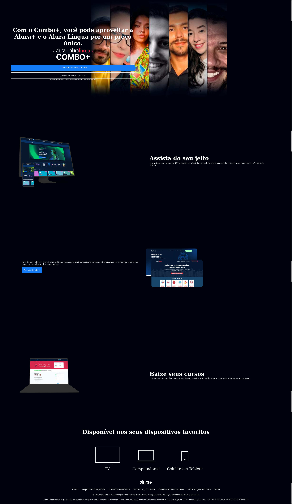

# Alura Plus - Projeto de Praticando HTML/CSS

## Sobre o Projeto

Este é o projeto Alura Plus desenvolvido durante o curso "Praticando HTML/CSS" da Alura Cursos Online. O objetivo deste projeto é criar um site de divulgação para a Alura Plus, uma plataforma de streaming que oferece conteúdos educacionais exclusivos da Alura.

## Tópicos Aprendidos

Durante o curso, aprendi os seguintes tópicos:

- 🌐 Construir um site utilizando HTML e CSS.
- 🎨 Identificar elementos e estilos através do Figma.
- 💡 Aplicar os conhecimentos adquiridos até agora em um projeto real.
- 📂 Criar um repositório para armazenar o código do projeto.
- 🌐 Realizar o deploy do site através do Github Pages ou Vercel.
- 🌍 Compartilhar o meu projeto com o mundo.

🎯 Desafio: 

- [ ] Adicionar responsividade

## Como Acessar o Site

Você pode acessar o site do projeto Alura Plus no seguinte link: [Alura Plus](https://aluraplus-eta-six-34.vercel.app/)

## Contribuição

Sinta-se à vontade para colaborar com este projeto ou dar sugestões. Este é um projeto em constante evolução, e qualquer contribuição é bem-vinda.

